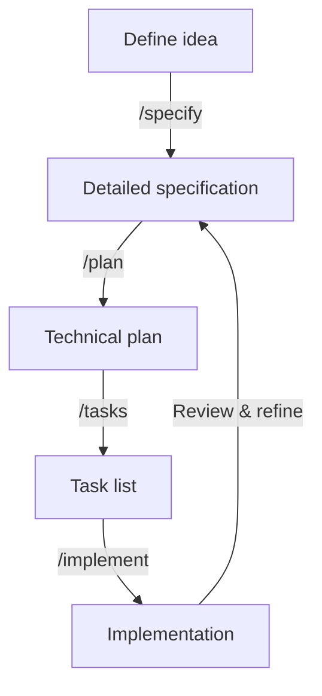

# Agent Guidelines & AI Collaboration

> Guidelines for AI agent usage, boundaries, and collaborative development patterns in Stitch CMS

**Reference**: CONST-P1 (API First), CONST-P6 (Spec-Driven Change Flow), CONST-P10 (Change Traceability)

This document establishes how to work productively and safely with AI coding agents such as GitHub Copilot, Claude, Gemini CLI, and others. It blends Stitch CMS rules with current GitHub guidance and industry best‑practices so that agents augment rather than replace your expertise. The goal is to maintain a clear, structured process for using AI while preserving project quality and security.

### Purpose

- **Coding assistance** — Generate boilerplate, tests, repetitive code and refactor existing modules. Copilot excels at writing tests, debugging syntax and generating regular expressions. Chat‑based agents can answer questions or draft larger code sections.
- **Planning support** — Use AI models (Copilot, Claude, Gemini) to outline features, design architectures, break work into tasks and create documentation based on specifications. Spec Kit's four‑phase process (specify → plan → tasks → implement) helps turn high‑level ideas into actionable units.
- **Mentorship & review** — Ask agents to explain unfamiliar code or propose alternative designs. Always review suggestions carefully; AI does not replace your judgement.

---

## Core Principles

### Plan before coding

Spend 60–70% of your time planning the architecture, tech stack, UI/UX and breaking features into small tasks before any code is written. AI models are most effective with narrow, well‑defined scopes.

Use the spec‑driven development model:



- **Specify:** Describe what and why you are building. Focus on user journeys and outcomes. The coding agent generates a living specification.
- **Plan:** Provide your desired stack, architecture and constraints. The agent produces a comprehensive technical plan reflecting standards and compliance requirements.
- **Tasks:** Break the specification and plan into small, testable tasks. Each task should be isolated, making it easy to validate outputs.
- **Implement:** The agent executes tasks one by one. You review each change, ensuring it aligns with the spec and plan.

---

## 🎯 AI Agent Principles


### Core Guidelines
1. **Governance First**: AI-generated code must follow all constitutional principles
2. **Human Oversight**: AI suggestions require human review and approval
3. **Traceability**: All AI-assisted changes must reference appropriate TASK-XXX items
4. **Quality Standards**: AI code must meet same standards as human-written code
5. **Transparency**: Clearly indicate when AI assistance was used

### Constitutional Alignment
- **CONST-P1 (API First)**: AI agents should prioritize API design in suggestions
- **CONST-P6 (Spec-Driven)**: AI should reference SPEC documents for context
- **CONST-P10 (Traceability)**: All AI changes must be traceable to tasks

---

## Understand agent strengths and limits

AI assistants are great at writing tests, repetitive code, commenting and explaining code. They are not designed to answer unrelated questions or replace your expertise. Choose the right tool:

| Tool                  | Use case (short)                                 |
|-----------------------|-------------------------------------------------|
| Code completion       | Completing snippets and variable names; generating repetitive code and tests |
| Copilot Chat/other chat agents | Answering questions, generating larger sections of code, reviewing code and acting as a specific persona |

---

## Craft thoughtful prompts

When asking the agent for help, break down complex tasks, be specific about your requirements, provide examples of inputs/outputs and follow good coding practices. Use comments in code or structured instructions to steer the model. If output is unclear, rephrase or split the request into smaller prompts.

---

## Provide relevant context

Open relevant files and close irrelevant ones when using Copilot in your IDE. In chat, remove context that is no longer helpful or start a new conversation. Provide explicit context such as repository names, file paths or symbols to focus the agent.

---

## Check the agent's work

Always validate suggested code before implementing it. Understand what the agent wrote; ask the model to explain the code if needed. Consider functionality, security, readability and maintainability. Use automated tests, linters and security scanners to verify the output.

---

## Manage context and tokens

Keep the conversation focused. Limit context to 32k tokens or less. Pass only the files and snippets relevant to the current task. Start new conversations at natural breakpoints (after finishing a feature or when switching contexts). Avoid overwhelming the model with extraneous code or history.

---

## Use multiple models

Different models excel at different tasks: use Claude for high‑level planning and architecture, GPT‑4 or Copilot for precise coding tasks, and Gemini for creative exploration. Combine outputs from several models to achieve better results.

---

## Bind the AI contract

Define clear constraints before each session (e.g., no any types in TypeScript, adhere to PascalCase for components) and remind the agent of these rules when context resets. If the agent violates the contract, reset the conversation or ask it to reevaluate its approach.

---

## Evaluate and iterate

Adopt an Evaluator–Optimizer pattern: first ask an agent to produce output; then use another agent to critique it against style guides, security best‑practices and your project rules. Iterate until quality standards are met. Always retain human oversight, especially for creative or sensitive decisions.

---

## Task Example

Below is a simple session that uses Spec Kit commands to generate a feature specification, technical plan and tasks. These commands are run in a chat interface with your coding agent after `specify init` has been executed:

```
/constitution Create principles focused on code quality, testing standards, user experience consistency and performance requirements
/specify Build a minimal photo‑album app. Users can create albums grouped by date and drag photos between albums. Photos are displayed in a grid.
```

### Constitutional Alignment
- **CONST-P1 (API First)**: AI agents should prioritize API design in suggestions
- **CONST-P6 (Spec-Driven)**: AI should reference SPEC documents for context
- **CONST-P10 (Traceability)**: All AI changes must be traceable to tasks

## 🤖 Approved AI Tools

### ✅ Recommended Tools

#### **GitHub Copilot**
- **Usage**: Code completion, function generation, test writing
- **Strengths**: Context-aware, IDE integration, real-time suggestions
- **Guidelines**: Review all suggestions before accepting
- **License**: Approved for commercial use

#### **Claude/GPT via API**
- **Usage**: Architecture decisions, complex problem solving, documentation
- **Strengths**: Complex reasoning, architectural planning
- **Guidelines**: Use for planning, not direct code generation
- **License**: Check usage rights for commercial projects

#### **Specialized Tools**
- **Copilot Chat**: Code explanation, debugging assistance
- **Code Review Agents**: PR analysis and suggestions
- **Documentation Generators**: API docs, README generation

### ❌ Restricted/Prohibited
- **Untrusted Models**: No local or unverified AI models
- **Code Obfuscation**: AI should not make code less readable
- **Governance Bypass**: AI cannot override governance requirements
- **Sensitive Data**: No AI processing of production data/secrets

## 🔄 AI-Human Collaboration Patterns

### Pattern 1: AI-Assisted Development
```
Human: Defines requirements (SPEC/TASK)
   ↓
AI: Generates implementation suggestions
   ↓
Human: Reviews, modifies, approves
   ↓
Standard: PR review and governance validation
```

### Pattern 2: AI-Guided Architecture
```
Human: Presents architectural challenge
   ↓
AI: Suggests approaches and trade-offs
   ↓  
Human: Makes decision, documents in ADR
   ↓
Team: Reviews ADR through standard process
```

### Pattern 3: AI Documentation Enhancement
```
Human: Creates initial documentation
   ↓
AI: Suggests improvements, examples, clarity
   ↓
Human: Reviews and incorporates suggestions
   ↓
Team: Reviews through governance process
```

## 📝 Prompt Engineering Guidelines

### Effective Prompts for Stitch CMS

#### ✅ Good Prompts
```
# Context-Rich Prompts
"Based on our FastAPI + SQLAlchemy async architecture (ADR-0001), 
implement user authentication following TASK-001 requirements. 
Ensure CONST-P2 (async core) and CONST-P7 (observability) compliance."

# Governance-Aware Prompts
"Create a content creation endpoint that follows our API-first principle 
(CONST-P1) and references SPEC-001 content management requirements. 
Include proper error handling and logging."

# Architecture-Aligned Prompts
"Design a module system component that integrates with our existing 
PLAN-002 modular architecture. Consider extensibility and CONST-P3 
(extensible by design) principle."
```

#### ❌ Poor Prompts
```
# Vague Requests
"Make the auth better"
"Fix this code"
"Add some features"

# Governance-Blind Requests  
"Generate a complete authentication system"
"Create whatever you think is best"
"Ignore the existing patterns"
```

### Prompt Templates

#### Code Generation Template
```
**Context**: [Brief description of current system state]
**Reference**: TASK-XXX, CONST-PX, PLAN-XXX
**Requirements**: [Specific requirements from SPEC/TASK]
**Constraints**: [Technical or architectural constraints]
**Request**: [Specific code generation request]
**Output Format**: [Preferred format - component, function, etc.]
```

#### Architecture Consultation Template
```
**Challenge**: [Describe the architectural challenge]
**Current State**: [Reference existing PLAN/ADR items]
**Options Considered**: [Any approaches already evaluated]
**Constraints**: [Constitutional or technical constraints]  
**Request**: [Specific guidance needed]
**Decision Format**: [ADR, PLAN update, etc.]
```

## 🛡️ Quality Assurance for AI-Generated Code

### Pre-Submission Checklist

#### ✅ Code Quality
- [ ] Code follows project conventions
- [ ] Proper error handling included
- [ ] Logging and observability added
- [ ] TypeScript types are accurate
- [ ] Comments explain complex logic

#### ✅ Governance Compliance
- [ ] References appropriate TASK-XXX
- [ ] Aligns with constitutional principles
- [ ] Follows architectural patterns from PLAN
- [ ] Maintains traceability chain

#### ✅ Security Review
- [ ] No hardcoded secrets or credentials
- [ ] Input validation included
- [ ] Authentication/authorization checked
- [ ] SQL injection prevention
- [ ] XSS prevention for UI code

#### ✅ Testing Requirements
- [ ] Unit tests included for new functions
- [ ] Integration tests for API endpoints
- [ ] Error case testing
- [ ] Performance considerations addressed

### AI Code Review Process

#### Level 1: Automated Validation
```bash
# Governance validation
python3 scripts/governance/validate_all.py

# Code quality checks
npm run lint
npm run type-check

# Build verification
npm run build
```

#### Level 2: Human Review
- **Author Review**: Developer reviews AI suggestions before commit
- **Peer Review**: Standard PR review process
- **Architecture Review**: For significant AI-generated architectural changes

#### Level 3: AI-Specific Checks
- **Prompt Documentation**: Document the prompt used for AI generation
- **Alternative Approaches**: Consider if AI suggestion is the best approach
- **Maintenance Impact**: Assess long-term maintainability

## 📚 AI Agent Usage Scenarios

### ✅ Recommended Use Cases

#### **Boilerplate Generation**
```typescript
// Prompt: "Generate a CRUD API router following our FastAPI patterns"
// Good for: Standard endpoints, model definitions, basic components
// Human oversight: Verify business logic, error handling
```

#### **Test Creation**
```typescript
// Prompt: "Create comprehensive tests for this authentication function"  
// Good for: Unit tests, integration tests, edge case coverage
// Human oversight: Verify test completeness, mock accuracy
```

#### **Documentation Generation**
```markdown
<!-- Prompt: "Generate API documentation for these endpoints" -->
<!-- Good for: OpenAPI specs, README sections, code comments -->
<!-- Human oversight: Accuracy, completeness, team voice -->
```

#### **Code Refactoring**
```typescript
// Prompt: "Refactor this component to follow our modular patterns"
// Good for: Structure improvements, pattern adherence
// Human oversight: Functionality preservation, performance
```

### ⚠️ Use with Caution

#### **Architecture Decisions**
- AI can suggest approaches but humans must make decisions
- All significant changes require ADR documentation
- Team consensus needed for architectural changes

#### **Complex Business Logic**
- AI may not understand domain-specific requirements
- Requires careful review against SPEC documents
- May need iterative refinement with business stakeholders

#### **Security-Critical Code**
- Authentication and authorization logic
- Data validation and sanitization  
- Cryptographic implementations
- Always require security expert review

### ❌ Avoid AI For

#### **Governance Decisions**
- Constitutional amendments
- Task prioritization
- Architectural decision final approval
- Team process changes

#### **Production Secrets**
- Environment configuration
- API keys and credentials
- Database connection strings
- Deployment configurations

## 🔍 Monitoring and Metrics

### AI Usage Tracking
- **Code Generation Ratio**: % of code with AI assistance
- **Review Time Impact**: How AI affects PR review time
- **Bug Rate Correlation**: Issues in AI-generated vs human code
- **Governance Compliance**: AI code governance failure rate

### Quality Metrics
- **Test Coverage**: AI-generated code test coverage
- **Performance Impact**: AI code performance characteristics
- **Maintenance Burden**: Long-term maintenance of AI code
- **Documentation Quality**: AI-generated documentation accuracy

### Team Feedback
- **Developer Experience**: Survey on AI tool helpfulness
- **Productivity Impact**: Measure development velocity changes
- **Learning Curve**: Time to effective AI collaboration
- **Satisfaction**: Team satisfaction with AI-assisted development

## 🎓 Training and Best Practices

### Team Training Requirements

#### **New Team Members**
- AI tool setup and configuration
- Prompt engineering basics
- Governance compliance with AI
- Quality standards for AI code

#### **Ongoing Training**
- Monthly AI best practices sharing
- Quarterly review of AI guidelines
- Annual evaluation of AI tool effectiveness
- Continuous learning about new AI capabilities

### Best Practices

#### **Daily Usage**
1. **Start with Context**: Always provide relevant TASK/SPEC context
2. **Review Everything**: Never accept AI suggestions without review
3. **Document Decisions**: Note when and why AI assistance was used
4. **Maintain Standards**: AI code must meet same quality bar

#### **Code Review**  
1. **Flag AI Usage**: Indicate in PR when AI assistance was significant
2. **Extra Scrutiny**: Apply additional review for AI-generated code
3. **Educational Review**: Help team learn from AI patterns
4. **Governance Check**: Verify constitutional principle alignment

#### **Architecture Work**
1. **AI as Advisor**: Use AI for suggestions, not decisions
2. **Human Decision**: All architectural decisions made by humans
3. **Document Rationale**: Explain AI input in ADR documents
4. **Team Consensus**: Architectural changes require team agreement

## 🚨 Incident Response

### AI-Related Issues

#### **Code Quality Issues**
1. **Immediate**: Revert problematic AI-generated code
2. **Analysis**: Determine root cause (prompt, review, or AI limitation)
3. **Prevention**: Update guidelines to prevent similar issues
4. **Training**: Share learnings with team

#### **Security Vulnerabilities**
1. **Emergency**: Follow standard security incident response
2. **Investigation**: Determine if AI contributed to vulnerability  
3. **Remediation**: Fix issue and update AI usage guidelines
4. **Prevention**: Enhanced security review for AI code

#### **Governance Violations**
1. **Correction**: Fix governance compliance issues
2. **Root Cause**: Analyze why AI bypassed governance
3. **Process Update**: Strengthen governance validation
4. **Training**: Re-emphasize governance requirements

## 📋 AI Usage Documentation

### Required Documentation

#### **In Code Comments**
```typescript
/**
 * AI-Assisted: Generated with GitHub Copilot, reviewed and modified
 * Task: TASK-007 (Structured Logging Implementation)
 * Human Modifications: Added custom error handling and metrics
 */
function setupLogging() {
  // Implementation...
}
```

#### **In Commit Messages**
```bash
feat(logging): implement structured logging system (TASK-007)

AI-assisted code generation with GitHub Copilot.
Human modifications for error handling and metrics integration.
```

#### **In PR Descriptions**
```markdown
## AI Assistance Used
- **Tool**: GitHub Copilot
- **Scope**: Initial implementation of logging functions
- **Human Modifications**: Custom error handling, metric integration, test refinement
- **Review Level**: Standard + AI-specific quality checks
```

## 🔗 Integration with Governance

### Constitutional Compliance
- **CONST-P1**: AI must follow API-first development approach
- **CONST-P2**: AI-generated code must be async-first
- **CONST-P6**: AI must reference SPEC documents for requirements
- **CONST-P10**: AI changes must be traceable through TASK system

### Task Integration
- All AI-assisted work must reference specific TASK-XXX items
- AI cannot create or modify tasks without human approval
- Task status updates require human verification

### Review Process
- AI-generated code follows standard PR review process
- Additional AI-specific quality checks required
- Governance validation applies equally to AI and human code

---

## 📚 References

- **[Constitution](docs/governance/CONSTITUTION.md)**: Core principles for AI alignment
- **[Team Guide](docs/governance/TEAM_ADOPTION_GUIDE.md)**: Daily workflows with AI
- **[Repository Rules](docs/REPOSITORY_RULES.md)**: Branching and commit standards
- **[Architecture Plan](docs/architecture/PLAN.md)**: System context for AI

---

## Metadata
**Document Type**: AI Collaboration Guidelines  
**Version**: 1.0.0  
**Last Updated**: 2025-09-20  
**Review Schedule**: Quarterly (with rapid updates as AI tools evolve)  
**Owner**: Development Team  

**Change Log**:
- 2025-09-20: Initial AI agent guidelines and collaboration patterns

---

*These guidelines ensure AI assistance enhances our development process while maintaining governance standards, code quality, and architectural coherence.*